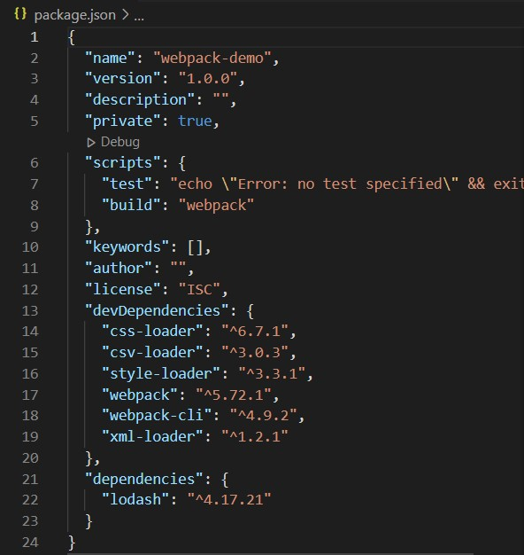

# npm

- a cli tool to manage plugins, libraries, tools

usage:
```
npm init 
npm install <package_name> 
```

- packages are managed with the package.json file which can be created by running ```npm init```
- package.json
    - lists packages your project depends on
    - specifies versions of a package that your project can use
- npm install --save-dev saves the dependency as a development dependancy

When the above command is ran, npm will automatically add lines to the dev dependencies section in the package.json:
