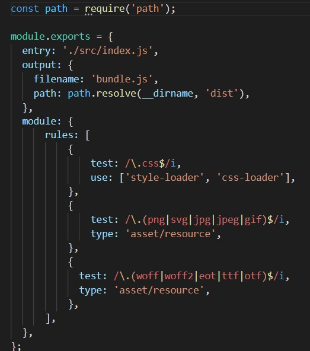

# webpack

- a module bundler
- used to compile JS modules, finds any dependencies in the **entry** file and generates code into a single **output** file (default: main.js)
- setup by:
```
npm init -y
npm install webpack webpack-cli --save-dev
```

When installing a package that will be bundled with production code use:
```
npm install --save
```
If installing a package for development purposes:
```
npm install--save-dev
```
Webpack allows you to include any other type of file, besides JS, as long as you have a loader for it. Put the loader in as a module(?)

```
npm install --save-dev style-loader css-loader
```
in webpack.config.js
```
 module: {
    rules: [
      {
        test: /\.css$/i,
        use: ['style-loader', 'css-loader'],
      },
    ],
  },
```
now import './style.css' works in a javascript file

Other loaders:



There are also plugins that manage and generate index.html for you.
refer to: https://webpack.js.org/guides/output-management/

Source maps:

When webpack bundles your source code, it can become difficult to track errors to their original location. We can use a source map to solve this problem. The source map will tell us which file the error/warning is coming from.

When you are tired of typing npm run build to compile code:
- watch mode
- webpack dev server
- webpack dev middleware